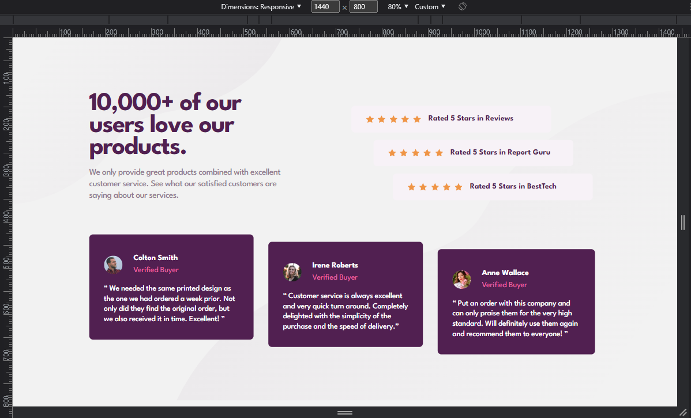
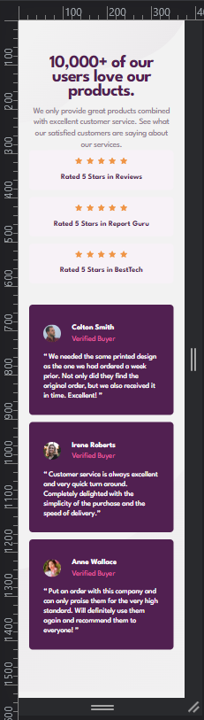

# Frontend Mentor - Social Proof Section

This is a solution to the [Social Proof Section Challeng on Frontend Mentor](https://www.frontendmentor.io/challenges/social-proof-section-6e0qTv_bA).

## Overview

 

 
 
 

## Screenshot

### Desktop Version

### Mobile Version

### Links

- [Solution in Front End Mentor Site:](https://www.frontendmentor.io/solutions/basic-html-and-css-3PEfQBLPRV)
- [Live Site](https://social-proof-six-tau.vercel.app/)

 
 

## My process

I spent some time without doing the challenges because I was studying other things, so I decided to return.

In this one I had difficulties with the asymmetrical placement of the testimonials cards and rate cards, and I also couldn't handle the placement of the background images very well. They are ok for the Figma project viewports, but in the intermediate viewports they are quite offset.

 

## Author

- Frontend Mentor - [@VitorMagnago](https://www.frontendmentor.io/profile/VitorMagnago)
